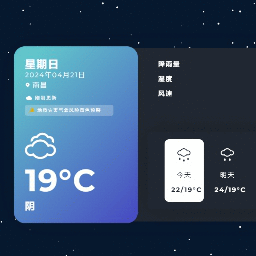

# 极简天气 QWeather (simple-weather-app-design)

一个基于 **Vue 3** 的极简天气应用，同时可作为 **Steam 壁纸引擎（Wallpaper Engine）** 的网页动态壁纸使用。界面灵感来自 CodePen，天气数据由 [和风天气 QWeather](https://www.qweather.com/) 提供，3D 动态背景由 [Vanta.js](https://www.vantajs.com/) 驱动。

> 该项目已发布至 Steam 创意工坊：《极简天气🌦️QWeather》
> Workshop ID：`3149014795`



---

## 功能特性

- **玻璃拟态 UI**：暗色磨砂玻璃卡片，左右分区信息更均衡、更易读，适配深色动态背景
- **实时天气**：当前温度、天气状况与天气图标（QWeather 图标字体）+ 体感温度、今日最高/最低温
- **近 4 天预报**：取和风 7 日预报接口前 4 天数据，支持点击切换查看每天的降雨量、湿度、风速、紫外线、气压、能见度、日出日落
- **生活指数**：展示当天穿衣 / 紫外线 / 运动 / 洗车 / 旅游 / 舒适度等指数（QWeather indices 接口）
- **天气预警**：蓝/黄/橙/红四级配色；主卡片预警自动轮播 + 数量角标；详情采用手风琴展开，溢出内容用 BetterScroll 鼠标拖拽滚动（适配 Wallpaper Engine 无法触发滚轮的场景）
- **一言**：卡片右侧每日一句，点击即可换一句（手动限 5 秒一次，每 12 小时自动刷新）
- **城市定位**：内置全国行政区划级联选择器（省/市/区），可自由切换城市；首次使用弹出欢迎引导弹窗
- **超长地名自适应**：对新疆等超长省市区名自动省略号截断，悬浮显示完整地名
- **动态背景系统**（5 种模式，可通过壁纸属性或 localStorage 切换）：
  - `0` 无背景
  - `1` 3D 小鸟（Vanta.js，可开启鼠标交互干扰飞行）
  - `2` 纯 CSS 星空（多层随机星点缓慢流动）
  - `3` 动态粒子连线（Canvas，鼠标跟随/点击弹射）
  - `4` 实时渲染雨滴（WebGL，可选隐藏天气面板全屏沉浸）
- **智能雨滴**：雨滴背景支持「自动」模式——根据实时天气文本自动匹配大雨/中雨/小雨/无雨强度
- **数据缓存与自动刷新**：按数据类型独立缓存（实时 10 分钟 / 预报 2 小时 / 预警 10 分钟 / 生活指数 1 小时），页面每分钟自动轮询，过期数据自动重新拉取
- **断网/失败恢复**：离线时显示离线状态，网络恢复自动重连；请求失败每 5 秒重试，连续失败超过 5 次降频为 30 秒重试
- **多域名负载均衡**：配置了多个和风 API 域名与密钥，请求自动轮询切换

## 技术栈

| 分类 | 技术 |
| --- | --- |
| 框架 | Vue 3（`<script setup>` 组合式 API）、Vue CLI 5 |
| 状态管理 | Pinia + pinia-plugin-persistedstate（状态持久化到 localStorage） |
| 请求 | Axios（拦截器注入密钥、统一错误码处理） |
| UI | Arco Design Vue（Cascader 级联选择、Button、Icon） |
| 动效 | Vanta.js、Three.js、@better-scroll/core、@formkit/auto-animate |
| 工具 | @vueuse/core（useStorage）、mitt（事件总线）、qweather-icons |
| 样式 | Sass/SCSS、本地化 Montserrat 字体、iconfont 图标 |

## 快速开始

环境要求：Node.js 14+，推荐使用 Yarn（项目同时提供 `package-lock.json`，npm 亦可）。

```bash
# 安装依赖
yarn install

# 启动开发服务器（热更新）
yarn serve

# 生产构建
yarn build

# 代码检查与修复
yarn lint
```

也可以直接双击根目录下的 `start.bat`（等价于执行 `yarn serve`）。

构建产物输出到 `dist/`。由于 `vue.config.js` 中配置了 `publicPath: './'`，打包后的文件可以直接在本地以相对路径打开运行，方便作为壁纸引擎的本地网页源使用。

## 环境变量配置

项目通过根目录 `.env` 文件配置天气接口、密钥与缓存时效。**`.env` 中包含真实 API 密钥，请勿提交到公开仓库**（建议加入 `.gitignore`）。

```ini
# 和风天气 API 域名列表（逗号分隔，与 KEYS 一一对应）
VUE_APP_HOSTS=host1.example.com,host2.example.com,host3.example.com

# 和风天气 API 密钥列表（逗号分隔，与 HOSTS 按顺序配对）
VUE_APP_KEYS=key1,key2,key3

# 数据缓存时效（毫秒）
VUE_APP_WEATHER_UPDATE_REALTIME=600000    # 实时天气：10 分钟
VUE_APP_WEATHER_UPDATE_FOURDAYS=7200000   # 4 天预报：2 小时
VUE_APP_WEATHER_UPDATE_WARNING=600000     # 天气预警：10 分钟
```

> 说明：请求拦截器会根据当前请求的域名，在 `HOSTS` 列表中的下标去 `KEYS` 列表取对应密钥并自动附加到请求参数。

## 项目结构

```text
simple-weather-app-design
├── public/                        # 静态资源（壁纸引擎入口）
│   ├── index.html                 # 入口 HTML（Vue CLI 模板）
│   ├── project.json               # Steam 创意工坊壁纸属性配置（含说明/更新日志）
│   ├── preview.gif                # 创意工坊预览图
│   └── fonts/                     # QWeather 图标字体
├── src/
│   ├── main.js                    # 应用入口（注册 Pinia、auto-animate）
│   ├── App.vue                    # 根组件：背景 + 天气面板 + 预警弹窗
│   ├── api/
│   │   ├── weather.js             # 和风天气接口封装（定位/7日/实时/预警/生活指数）
│   │   ├── httpClient.js          # Axios 实例（密钥注入/错误码/离线状态）
│   │   ├── hostPool.js            # 多域名/多 Key 轮询池
│   │   └── errors.js              # 统一错误封装
│   ├── data/
│   │   └── CityList.js            # 全国省市区划数据（adcode）
│   ├── features/
│   │   ├── weather/
│   │   │   ├── WeatherMain.vue        # 天气主面板（玻璃卡片：当前/预报/指数/一言）
│   │   │   ├── SelectLocationDialog.vue # 城市选择弹窗（级联选择器）
│   │   │   ├── WelcomeModal.vue       # 首次使用欢迎弹窗
│   │   │   ├── EarlyWarningDetails.vue# 天气预警详情（手风琴 + BetterScroll）
│   │   │   ├── WeatherStateIndicator.vue# 加载/更新状态提示
│   │   │   ├── useWeatherRefresh.js   # 定时刷新 + 失败重试
│   │   │   └── useWeatherStore.js     # 天气状态：数据、缓存、加载状态
│   │   └── wallpaper/
│   │       ├── WallpaperDebugPanel.vue# 开发环境壁纸属性调试面板
│   │       ├── properties.js          # 壁纸属性状态/监听（WE/调试共用）
│   │       ├── constants.js           # 壁纸属性 Key、Bus 事件、存储 Key
│   │       ├── backgroundConfig.js    # 各背景专属配置
│   │       └── backgrounds/
│   │           ├── BackgroundMain.vue # 背景切换 + 壁纸属性监听
│   │           ├── VantaBird.vue      # 3D 小鸟
│   │           ├── StarrySky.vue      # CSS 星空
│   │           ├── DynamicParticle.vue# 粒子连线
│   │           └── rain/
│   │               ├── RainEffect.vue # WebGL 实时雨滴
│   │               ├── RainEffectCore.js
│   │               └── RainConfig.js
│   ├── shared/
│   │   └── Bus.js                 # mitt 事件总线
│   ├── store/
│   │   ├── index.js                # Pinia 实例（含持久化插件）
│   │   └── modules/
│   │       └── useWallpaperOptionsStore.js # 壁纸选项 store
│   ├── style/                      # 全局样式、设计令牌、字体、图标
│   ├── assets/
│   │   └── dock-1365387_1920.jpg  # 雨滴背景底图
│   └── fonts/                      # Montserrat 本地字体
├── .env                            # 环境变量（API 域名/密钥/缓存时效）
├── vue.config.js                   # CLI 配置（相对路径、关闭 sourcemap 等）
├── jsconfig.json                   # 路径别名 @ -> src
└── start.bat                       # 一键启动脚本
```

## 核心实现说明

### 数据流

`WeatherMain.vue` 挂载后调用 `updateWeather()`，每 60 秒轮询一次：

1. 先检查 `navigator.onLine`，离线则进入「已离线」状态，监听 `online` 事件自动恢复；
2. 并行请求「4 日预报 / 实时天气 / 天气预警」三个接口；生活指数独立、尽力而为地请求，失败不影响整体状态；
3. 每次请求前先校验数据缓存时效（见 `.env`），未过期直接使用本地数据；
4. 成功后写入 Pinia store（持久化到 localStorage），失败按 5 秒 / 30 秒退避重试；

> 持久化密钥带有版本号：天气数据为 `WeatherApp-2026-9-1`，壁纸选项为 `WallpaperOptions-2026-9.1`。
> 每次数据源/结构变化时更新版本号即可让用户端强制重新拉取，避免读到旧结构的缓存。

### 加载状态码

store 中的 `TheWeatherDataIsLoaded` 用于驱动天气面板的状态提示：

| 状态码 | 含义 |
| --- | --- |
| `100` | 加载中 |
| `200` | 加载成功（显示“刚刚更新 / X 分钟前更新”） |
| `300` | 请求失败，正在重试 |
| `400` | 无网络（离线） |
| `0` | 未知错误（建议重新应用壁纸） |

### 壁纸引擎（Wallpaper Engine）集成

`BackgroundMain.vue` 中注册了 `window.wallpaperPropertyListener.applyUserProperties`，壁纸属性定义在 `public/project.json`，用户可在壁纸设置面板实时调整：

| 属性 | 类型 | 说明 |
| --- | --- | --- |
| `backgroundindex` | 下拉框 | 切换背景：0 无 / 1 小鸟 / 2 星空 / 3 粒子 / 4 雨滴 |
| `backgroundinteraction` | 开关 | 小鸟背景的鼠标交互 |
| `showweathermain` | 开关 | 雨滴模式下隐藏/显示天气面板 |
| `rainconfig` | 下拉框 | 雨滴强度：自动 / 大雨 / 中雨 / 小雨 / 雨停 |

切换背景时会通过 mitt 事件总线（`Bus.js`）通知 `WeatherMain` 隐藏天气面板。

**开发环境调试**：`window.wallpaperPropertyListener` 只在 Wallpaper Engine 中存在，
因此在开发模式下由 `WallpaperDebugPanel.vue`（页面右上角，基于 Arco Design 组件构建）
模拟壁纸属性面板。面板按 `public/project.json` 中 `backgroundindex` 的 condition 划分：
`背景` 是全局切换属性，`小鸟互动` 只在“小鸟”背景显示，`隐藏天气面板` 与 `雨滴配置`
只在“实时雨滴”背景显示，均出现在对应背景的“专属配置”区块中。
它和壁纸引擎走同一套 `applyWallpaperProperties` 处理逻辑（见 `src/utils/wallpaperProperties.js`），
调试结果与生产环境一致；修改会持久化到 localStorage，切换背景刷新页面后自动恢复。

此外每个背景还有**运行时效果参数**（见 `src/utils/wallpaperConfig.js`），按背景序号分开存储、
互不干扰：动态粒子可调粒子数量与连线距离，实时雨滴可调雨滴大小、每秒数量与同时存在上限
（覆盖在雨滴强度预设之上，“雨停”除外），与 `rainconfig` 同处“实时雨滴专属配置”区块。
面板中切换到对应背景即可看到并实时调整这些参数，修改后立即生效并持久化；给其他背景新增
可调参数时，只需在 `backgroundConfigSchema` 中补充字段定义并让对应组件应用即可。

## 注意事项

- 和风天气 Web API 按域名绑定密钥，若需更换接口地址，请同步修改 `.env` 中的域名与密钥配对；
- 雨滴背景基于 WebGL，请确保设备支持；若性能不足可在壁纸属性中关闭或选择其它背景；
- 项目定位接口依赖和风 `city/lookup`，选择城市后按 adcode 拉取天气；
- 项目主要面向中国大陆用户，天气数据与字体资源均为国内可直接访问的来源。

## 致谢与免责

- 天气数据：[和风天气](https://www.qweather.com/)
- 3D 背景：[Vanta.js](https://www.vantajs.com/) / Three.js
- 界面灵感：[CodePen](https://www.codepen.com/)
- 本壁纸无盈利性质，所有数据来源于网络，若有侵权请联系删除。
