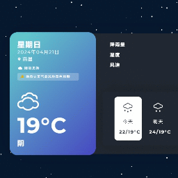

# 极简天气 QWeather (simple-weather-app-design)

一个基于 **Vue 3** 的极简天气应用，同时可作为 **Steam 壁纸引擎（Wallpaper Engine）** 的网页动态壁纸使用。界面灵感来自 CodePen，天气数据由 [和风天气 QWeather](https://www.qweather.com/) 提供，3D 动态背景由 [Vanta.js](https://www.vantajs.com/) 驱动。

> 该项目已发布至 Steam 创意工坊：《极简天气🌦️QWeather》
> Workshop ID：`3149014795`



---

## 功能特性

- **玻璃拟态 UI**：暗色磨砂玻璃卡片，左右分区信息更均衡、更易读，适配深色动态背景
- **实时天气**：当前温度、天气状况与天气图标（QWeather 图标字体）+ 体感温度、今日最高/最低温
- **近 4 天预报**：取和风 7 日预报接口前 4 天数据，支持点击切换查看每天的降雨量、湿度、风速、紫外线、气压、能见度、日出日落
- **生活指数**：展示当天穿衣 / 紫外线 / 运动 / 洗车 / 旅游 / 舒适度等指数（QWeather indices 接口）
- **天气预警**：蓝/黄/橙/红四级配色；主卡片预警自动轮播 + 数量角标；详情采用手风琴展开，溢出内容用 BetterScroll 鼠标拖拽滚动（适配 Wallpaper Engine 无法触发滚轮的场景）
- **一言**：卡片右侧每日一句，点击即可换一句（手动限 5 秒一次，每 12 小时自动刷新）
- **城市定位**：内置全国行政区划级联选择器（省/市/区），可自由切换城市；首次使用弹出欢迎引导弹窗
- **超长地名自适应**：对新疆等超长省市区名自动省略号截断，悬浮显示完整地名
- **动态背景系统**（6 种模式，可通过壁纸属性或 localStorage 切换，默认 `5`）：
  - `0` 无背景
  - `1` 3D 小鸟（Vanta.js，可开启鼠标交互干扰飞行）
  - `2` 纯 CSS 星空（多层随机星点缓慢流动）
  - `3` 动态粒子连线（Canvas，鼠标跟随/点击弹射）
  - `4` 实时渲染雨滴（WebGL，可选隐藏天气面板全屏沉浸）
  - `5` 整页雨珠叠加（WebGL 透明雨珠层盖在真实 DOM 之上，天气面板照样被雨珠折射、照样可点）
- **智能雨滴**：`4` / `5` 两种雨滴背景都支持「自动」模式——按实时天气（图标代码优先，其次天气文本）自动匹配暴雨/大雨/中雨/小雨/无雨
- **数据缓存与自动刷新**：按数据类型独立缓存（实时 15 分钟 / 预报 2 小时 / 预警 20 分钟 / 生活指数 3 小时），页面每分钟自动轮询，过期数据自动重新拉取；生活指数与主周期错峰触发，保证每个周期的请求数与域名池大小对齐
- **断网/失败恢复**：离线时显示离线状态，网络恢复自动重连；请求失败每 5 秒重试，连续失败超过 5 次降频为 30 秒重试
- **多域名负载均衡**：配置了多个和风 API 域名与密钥，请求按域名轮询切换；轮询下标持久化到 localStorage，首次运行随机取起点，避免第一个域名被过度请求

## 技术栈

| 分类 | 技术 |
| --- | --- |
| 框架 | Vue 3（`<script setup>` 组合式 API）、Vue CLI 5 |
| 状态管理 | Pinia + pinia-plugin-persistedstate（状态持久化到 localStorage） |
| 请求 | Axios（拦截器注入密钥、统一错误码处理） |
| UI | Arco Design Vue（Cascader 级联选择、Button、Icon） |
| 动效 | Vanta.js、Three.js、@better-scroll/core、@formkit/auto-animate |
| 工具 | @vueuse/core（useStorage）、mitt（事件总线）、qweather-icons |
| 样式 | Sass/SCSS、本地化 Montserrat 字体、iconfont 图标 |

## 快速开始

环境要求：Node.js 14+，推荐使用 Yarn（项目同时提供 `package-lock.json`，npm 亦可）。

```bash
# 安装依赖
yarn install

# 启动开发服务器（热更新）
yarn serve

# 生产构建：输出到 dist/，并同步到 Wallpaper Engine 工程目录
yarn build

# 只构建到 dist/，不同步壁纸工程
yarn build:dist

# 代码检查与修复
yarn lint
```

也可以直接双击根目录下的 `start.bat`（等价于执行 `yarn serve`）。

由于 `vue.config.js` 中配置了 `publicPath: './'`，打包后的文件可以直接在本地以相对路径打开运行，方便作为壁纸引擎的本地网页源使用。

### 同步到 Wallpaper Engine 工程

`yarn build` 会先把构建产物输出到 `dist/`，随后由 `scripts/deploy-wallpaper-engine.js` 同步到壁纸工程目录，省去手动复制：

```bash
# 只同步现有的 dist/（不重新构建）
yarn deploy:we

# 工程目录不在默认位置时，用环境变量指定
WE_PROJECT_DIR="D:/path/to/we/project" yarn deploy:we
```

默认工程目录为 `D:/Steam/steamapps/common/wallpaper_engine/projects/myprojects/qweater`，脚本用它作为 `dist` 的镜像输出目录，行为如下：

- 先删除工程目录里的上一轮构建产物（`index.html`、`js/`、`css/`、`img/`、`fonts/`、`favicon.ico` 等），避免旧 hash 文件堆积；
- 再把 `dist/` 里的内容写入工程目录；
- **保留** `preview.jpg` 等由 Wallpaper Engine 自己维护的文件，不会被 `public/` 里的旧版本覆盖；
- `project.json` 只合并其中的**壁纸属性定义**（`general.properties`，以 `public/project.json` 为准，写回前会按 `order` 重新编号 `index`），
  `workshopid`、`version`、`preview`、`description`、`tags` 等由壁纸引擎维护的字段原样保留；
  不想合并时加 `WE_SYNC_PROPERTIES=0`；
- 如果目标目录不存在或缺少 `project.json`，脚本会直接报错退出，不会误删其他目录。

> 为什么必须合并属性定义：壁纸引擎读的是**工程目录里**的 `project.json`，而不是 `public/project.json`。
> 只改 `public/project.json` 而不合并的话，属性面板里看不到新加的选项（例如 `backgroundindex` 的「整页雨珠叠加」），
> 于是「明明代码支持，却没法在壁纸属性里打开」。

## 环境变量配置

项目通过根目录 `.env` 文件配置天气接口、密钥与缓存时效。**`.env` 中包含真实 API 密钥，请勿提交到公开仓库**（建议加入 `.gitignore`）。

```ini
# 和风天气 API 域名列表（逗号分隔，与 KEYS 一一对应）
VUE_APP_HOSTS=host1.example.com,host2.example.com,host3.example.com

# 和风天气 API 密钥列表（逗号分隔，与 HOSTS 按顺序配对）
VUE_APP_KEYS=key1,key2,key3

# 数据缓存时效（毫秒）
VUE_APP_WEATHER_UPDATE_REALTIME=900000    # 实时天气：15 分钟
VUE_APP_WEATHER_UPDATE_FOURDAYS=7200000   # 4 天预报：2 小时
VUE_APP_WEATHER_UPDATE_WARNING=1200000    # 天气预警：20 分钟
VUE_APP_WEATHER_UPDATE_INDICES=10800000   # 生活指数：3 小时
```

> 说明：请求拦截器会根据当前请求的域名，在 `HOSTS` 列表中的下标去 `KEYS` 列表取对应密钥并自动附加到请求参数。

## 项目结构

```text
simple-weather-app-design
├── public/                        # 静态资源（壁纸引擎入口）
│   ├── index.html                 # 入口 HTML（Vue CLI 模板）
│   ├── project.json               # Steam 创意工坊壁纸属性配置（含说明/更新日志）
│   ├── preview.gif                # 创意工坊预览图
│   └── fonts/                     # QWeather 图标字体
├── src/
│   ├── main.js                    # 应用入口（注册 Pinia、auto-animate）
│   ├── App.vue                    # 根组件：背景 + 天气面板 + 预警弹窗
│   ├── api/
│   │   ├── weather.js             # 和风天气接口封装（定位/7日/实时/预警/生活指数）
│   │   ├── httpClient.js          # Axios 实例（密钥注入/错误码/离线状态）
│   │   ├── hostPool.js            # 多域名/多 Key 轮询池
│   │   └── errors.js              # 统一错误封装
│   ├── data/
│   │   └── CityList.js            # 全国省市区划数据（adcode）
│   ├── features/
│   │   ├── weather/
│   │   │   ├── WeatherMain.vue        # 天气主面板（玻璃卡片：当前/预报/指数/一言）
│   │   │   ├── SelectLocationDialog.vue # 城市选择弹窗（级联选择器）
│   │   │   ├── WelcomeModal.vue       # 首次使用欢迎弹窗
│   │   │   ├── EarlyWarningDetails.vue# 天气预警详情（手风琴 + BetterScroll）
│   │   │   ├── WeatherStateIndicator.vue# 加载/更新状态提示
│   │   │   ├── useWeatherRefresh.js   # 定时刷新 + 失败重试
│   │   │   └── useWeatherStore.js     # 天气状态：数据、缓存、加载状态
│   │   └── wallpaper/
│   │       ├── WallpaperDebugPanel.vue# 开发环境壁纸属性调试面板
│   │       ├── properties.js          # 壁纸属性状态/监听（WE/调试共用）
│   │       ├── constants.js           # 壁纸属性 Key、Bus 事件、存储 Key
│   │       ├── backgroundConfig.js    # 各背景专属配置
│   │       └── backgrounds/
│   │           ├── BackgroundMain.vue # 背景切换 + 壁纸属性监听
│   │           ├── VantaBird.vue      # 3D 小鸟
│   │           ├── StarrySky.vue      # CSS 星空
│   │           ├── DynamicParticle.vue# 粒子连线
│   │           ├── rain/
│   │           │   ├── RainEffect.vue # WebGL 实时雨滴（自带背景图）
│   │           │   ├── RainEffectCore.js # raindrop-fx v1.0.8 bundle
│   │           │   └── RainConfig.js  # 大/中/小/无雨预设
│   │           └── rain-overlay/      # 整页雨珠叠加（盖在真实 DOM 上）
│   │               ├── RainOverlayEffect.vue # 底图 + 全屏雨珠叠加层
│   │               ├── RainOverlayAdapter.js # 透明叠加补丁 + DOM 快照折射源
│   │               ├── RainOverlayConfig.js  # 叠加背景专属的雨量预设（与 rain/ 分开维护）
│   │               └── lib/
│   │                   ├── raindrop-fx.js    # raindrop-fx v1.0.8 bundle
│   │                   └── html2canvas.min.js# 1.4.1，把 DOM 光栅化成折射纹理
│   ├── shared/
│   │   └── Bus.js                 # mitt 事件总线
│   ├── store/
│   │   ├── index.js                # Pinia 实例（含持久化插件）
│   │   └── modules/
│   │       └── useWallpaperOptionsStore.js # 壁纸选项 store
│   ├── style/                      # 全局样式、设计令牌、字体、图标
│   ├── assets/
│   │   ├── dock-1365387_1920.jpg       # 雨滴背景底图（清晰，供 `4` 用）
│   │   └── dock-1365387_1920-blur.jpg  # 同一张图的预模糊版（供 `5` 的底图用）
│   └── fonts/                      # Montserrat 本地字体
├── .env                            # 环境变量（API 域名/密钥/缓存时效）
├── vue.config.js                   # CLI 配置（相对路径、关闭 sourcemap 等）
├── jsconfig.json                   # 路径别名 @ -> src
└── start.bat                       # 一键启动脚本
```

## 核心实现说明

### 数据流

`WeatherMain.vue` 挂载后调用 `updateWeather()`，每 60 秒轮询一次：

1. 先检查 `navigator.onLine`，离线则进入「已离线」状态，监听 `online` 事件自动恢复；
2. 并行请求「4 日预报 / 实时天气 / 天气预警」三个接口；生活指数独立、尽力而为地请求，失败不影响整体状态；
3. 每次请求前先校验数据缓存时效（见 `.env`），未过期直接使用本地数据；同一接口 + 同一城市的在途请求会复用同一个 Promise，避免手动定位与定时轮询撞车时重复请求；
4. 生活指数不在主周期内发送，而是错峰 30 秒、按独立节拍刷新，使每个定时周期的请求数（3 个）与多域名池大小一致；
5. 成功后写入 Pinia store（持久化到 localStorage），失败按 5 秒 / 30 秒退避重试；

> 持久化密钥带有版本号：天气数据为 `WeatherApp-2026-9-1`，壁纸选项为 `WallpaperOptions-2026-9.1`。
> 每次数据源/结构变化时更新版本号即可让用户端强制重新拉取，避免读到旧结构的缓存。

### 加载状态码

store 中的 `TheWeatherDataIsLoaded` 用于驱动天气面板的状态提示：

| 状态码 | 含义 |
| --- | --- |
| `100` | 加载中 |
| `200` | 加载成功（显示“刚刚更新 / X 分钟前更新”） |
| `300` | 请求失败，正在重试 |
| `400` | 无网络（离线） |
| `0` | 未知错误（建议重新应用壁纸） |

### 壁纸引擎（Wallpaper Engine）集成

壁纸属性定义在 `public/project.json`（`yarn build` / `yarn deploy:we` 会把其中的属性定义合并进壁纸工程目录的 `project.json`），用户可在壁纸设置面板实时调整：

| 属性 | 类型 | 说明 |
| --- | --- | --- |
| `backgroundindex` | 下拉框 | 切换背景：0 无 / 1 小鸟 / 2 星空 / 3 粒子 / 4 雨滴 / 5 整页雨珠叠加（默认） |
| `backgroundinteraction` | 开关 | 小鸟背景的鼠标交互 |
| `showweathermain` | 开关 | 雨滴模式下隐藏/显示天气面板 |
| `rainconfig` | 下拉框 | 雨滴强度：自动 / 暴雨 / 大雨 / 中雨 / 小雨 / 雨停 |

切换背景时会通过 mitt 事件总线（`Bus.js`）通知 `WeatherMain` 隐藏天气面板。

#### 属性监听器为什么写在 index.html 里

官方文档（Web Wallpaper Reference → User Properties → Reading property values）有两条硬性要求：

1. `window.wallpaperPropertyListener` 必须在**任何事件之外、尽可能早**初始化为全局对象，
   否则壁纸加载时引擎下发的那一次属性更新会丢失（用户选好的背景就“打不开”）；
2. 加载时会**一次性下发全部属性**，之后每次只下发**发生变化**的属性，
   所以每个属性都要单独判空，不能假设一次能拿到所有字段。

因此实现拆成两段：

| 位置 | 职责 |
| --- | --- |
| `public/index.html` 的 `<head>` | 最早把 `window.wallpaperPropertyListener` 挂到全局，并把引擎下发的属性推进队列（`window.__wallpaperPropertyQueue`） |
| `src/features/wallpaper/properties.js` | `setupWallpaperPropertyListener()`：由 `src/main.js` 在 `mount()` 之后调用，先补发队列里的属性（此时组件与 Bus 监听器都已就绪），再把 `applyWallpaperProperties` 挂到消费列表接收后续变更 |

`applyWallpaperProperties` 会校验取值（`backgroundindex` 只认 `0`~`5`，`rainconfig` 只认六个档位），
非法值打警告并忽略，避免引擎下发的异常值把界面切到空白背景。

**开发环境调试**：`window.wallpaperPropertyListener` 只在 Wallpaper Engine 中存在，
因此在开发模式下由 `WallpaperDebugPanel.vue`（页面右上角，基于 Arco Design 组件构建）
模拟壁纸属性面板。面板按 `public/project.json` 中 `backgroundindex` 的 condition 划分：
`背景` 是全局切换属性，`小鸟互动` 只在“小鸟”背景显示，`隐藏天气面板` 只在“实时雨滴”背景显示，
`雨滴配置` 在“实时雨滴”与“整页雨珠叠加”两个背景下都显示，均出现在对应背景的“专属配置”区块中。
它和壁纸引擎走同一套 `applyWallpaperProperties` 处理逻辑（见 `src/features/wallpaper/properties.js`），
调试结果与生产环境一致；修改会持久化到 localStorage，切换背景刷新页面后自动恢复。

此外每个背景还有**运行时效果参数**（见 `src/features/wallpaper/backgroundConfig.js`），按背景序号分开存储、
互不干扰：动态粒子可调粒子数量与连线距离，实时雨滴与整页雨珠叠加都可调雨滴大小、每秒数量与同时存在上限
（覆盖在雨滴强度预设之上，“雨停”除外），整页雨珠叠加还多出快照分辨率与快照间隔，
它们与 `rainconfig` 同处对应背景的“专属配置”区块。
面板中切换到对应背景即可看到并实时调整这些参数，修改后立即生效并持久化；给其他背景新增
可调参数时，只需在 `backgroundConfigSchema` 中补充字段定义并让对应组件应用即可。

### 整页雨珠叠加（backgroundindex = 5）

`4 实时渲染雨滴` 是「全屏后处理」：raindrop-fx 每帧把传入的背景图铺满 canvas，再合成雨滴折射，
输出永远是一张不透明画面，所以它必须自带背景图，也只能盖在页面之上当背景。

`5 整页雨珠叠加` 把这一步换掉——由 `RainOverlayAdapter.js` 顶替 raindrop-fx 的 `renderer.drawBackground`，
改成把画布清成 `(0,0,0,0)` 全透明，canvas 上就只剩 alpha = 雨滴遮罩 的那一层，
再配上 `position: fixed; pointer-events: none` 盖在整个页面上：底图与天气面板都会被雨珠折射，
面板照常可点（已用命中测试验证 `document.elementFromPoint` 命中的仍是面板里的按钮本身）。

- **折射源**：`RainOverlayEffect.vue` 以 `document.body` 为源，用 html2canvas 把整页光栅化成纹理。
  叠加层自己的 canvas 带 `data-html2canvas-ignore`，不会被拍进自己的快照（否则会形成反馈环）。
  页面里若已有 canvas / video / img，也可以直接把它们当折射源，零成本且可每帧更新。
- **底图是预模糊的**：`dock-1365387_1920-blur.jpg` 是把底图用高斯模糊（sigma ≈ 16）烘焙后的版本。
  之所以不用 CSS `filter: blur()`：html2canvas 不支持 CSS filter，快照里会变回清晰图，
  于是雨珠内部折射出的内容会和可见底图对不上；烘焙进图片则两边天然一致，还顺带省了运行时开销，
  体积也从 620KB 降到 80KB。想换模糊程度用 `temp/_tools/blur-image.py` 重新生成即可：
  `python blur-image.py 原图.jpg 输出.jpg --sigma 16 --quality 85`。
- **性能**：折射不需要高分辨率、也不需要高帧率（雨滴内部本来就是被折射+模糊的小采样），
  默认快照分辨率 `0.25`、间隔 `400ms`，两者都能在调试面板里实时调整。
  帧率吃紧时优先降分辨率、再拉长间隔。
- **雨量预设单独一套**：见 `rain-overlay/RainOverlayConfig.js`，与 `rain/RainConfig.js` 完全独立。
  `4` 的雨滴画在不透明底图上，可以又大又密；`5` 的雨珠盖在真实文字上，同一套参数会糊住内容，
  所以 `5` 的雨滴整体更小更疏、拖尾更克制。四档的差异：

  | 档位 | 生成间隔 | 雨滴尺寸 | 同时上限 | 重力 | 拖尾密度 |
  | --- | --- | --- | --- | --- | --- |
  | 小雨 | 0.42–0.68s（≈1.8 滴/秒） | 26–50px | 60 | 1500 | 0.12 |
  | 中雨（默认） | 0.15–0.24s（≈5 滴/秒） | 40–78px | 150 | 2200 | 0.18 |
  | 大雨 | 0.04–0.07s（≈18 滴/秒） | 62–112px | 320 | 3300 | 0.30 |
  | 暴雨 | 0.018–0.04s（≈34 滴/秒） | 76–138px | 460 | 3700 | 0.38 |
  | 雨停 | — | — | 0 | — | — |

- **自动档怎么同步天气**：见 `src/features/wallpaper/rainIntensity.js`，两个雨滴背景共用同一个映射。
  优先用和风天气的 icon 代码（最稳），icon 缺失或未知时退回天气文本：

  | 档位 | 图标代码 | 文本兜底 |
  | --- | --- | --- |
  | 暴雨 | 308 / 310 / 311 / 312 / 316 / 317 / 318 | 特大暴雨、大暴雨、暴雨、极端降雨 |
  | 大雨 | 302 / 303 / 307 / 315 / 351 | 强阵雨、大到暴雨、中到大雨、大雨 |
  | 中雨 | 301 / 304 / 306 / 314 / 350 / 399 | 中雨、阵雨、雷阵雨、冻雨、降水 |
  | 小雨 | 300 / 305 / 309 / 313 | 小雨、细雨、毛毛雨、微雨 |
  | 无雨 | 其余（晴 / 多云 / 阴 / 雪等） | 不含「雨」的文本 |

  天气数据本身走实时天气接口的缓存时效（默认 15 分钟，见 `.env`），刷新后自动重新选档；
  组件同时监听 `icon` 与 `text`，任一变化都会重算（以前只看 `text`，图标变了但文本没变时不会重算）。
- **拖尾水滴会“吃掉”大水滴的质量**：库里 `split()` 每走一段 `trailDistance` 就复制一颗拖尾水滴，
  并执行 `this.mass -= i.mass`，而拖尾水滴的质量 = (父尺寸 × `trailDropSize` × `trailDropDensity`)²。
  用库默认的 `[0.3, 0.5]` + `[20, 30]` 时，大水滴一秒内就把大半质量转给了拖尾，
  60fps 等效下跑 12 秒，雨滴尺寸从 138 掉到 47——表现就是「刚切到暴雨那一下很大，随后越来越小」。
  两套预设都已改成 `trailDistance [70, 120]` + `trailDropSize [0.12, 0.22]` + 更低的 `trailDropDensity`，
  同一实测口径下尺寸稳定在 121 左右。
- **凝结水珠层默认开启成小颗粒低密度**：raindrop-fx 里 `dropletsPerSeconds` / `dropletSize` 控制的不是下落雨滴，
  而是那层「凝结水珠」——它只被下落雨滴擦掉、不会自己变淡，所以密度越高越像一片水渍，
  叠在真实 UI 上会把文字糊住（原中雨预设是 500 个/秒、10~30px，十几秒就明显遮挡）。
  现在四档雨量统一用 **2~20px、150 个/秒**（见 `RainOverlayConfig.js` 的 `overlayBase`），
  颗粒小、数量少，靠不停落下的雨滴不断擦除，稳定在「玻璃上有水汽」的湿润感。
  只有「雨停」保持关闭：没有下落雨滴去擦，这一层会只增不减地越积越糊。
  想再调就动调试面板的「凝结水珠大小 / 凝结水珠数量/秒」（与预设同值，改过后即以改过的值为准，
  点「恢复该背景默认参数」可回到这两个数）。
- **显式调过才覆盖预设**：调试面板里的「凝结水珠大小 / 数量 / 雨滴同时上限」只有在真的调过之后
  才会覆盖上面四档预设，否则切档时这些值会被默认值抹平、看不出雨量差异。
- **已知取舍**：html2canvas 是 CPU 重绘，不会重绘 `backdrop-filter`、跨域未开 CORS 的图片等内容；
  页面主体若本来就是 WebGL canvas，直接把那个 canvas 当折射源更划算。
- **版本敏感**：透明叠加补丁依赖 raindrop-fx 内部的 `renderer.drawBackground` 与 `renderer.renderer.gl`
  （上游为 private 字段，靠未改名才顶得上）。适配器会先检查结构，不匹配时抛出明确错误而不是静默失效，
  升级 raindrop-fx 后请重跑一次验证。

## 注意事项

- 和风天气 Web API 按域名绑定密钥，若需更换接口地址，请同步修改 `.env` 中的域名与密钥配对；
- 雨滴背景基于 WebGL，请确保设备支持；若性能不足可在壁纸属性中关闭或选择其它背景；
- 项目定位接口依赖和风 `city/lookup`，选择城市后按 adcode 拉取天气；
- 项目主要面向中国大陆用户，天气数据与字体资源均为国内可直接访问的来源。

## 致谢与免责

- 天气数据：[和风天气](https://www.qweather.com/)
- 3D 背景：[Vanta.js](https://www.vantajs.com/) / Three.js
- 界面灵感：[CodePen](https://www.codepen.com/)
- 本壁纸无盈利性质，所有数据来源于网络，若有侵权请联系删除。
